<!-- ============================== HEADER ============================== -->
<div align="center">

<svg xmlns="http://www.w3.org/2000/svg" width="1000" height="260" viewBox="0 0 1000 260" xmlns:c2pa="http://c2pa.org/manifest"><metadata><c2pa:manifest>AAAWgmp1bWIAAAAeanVtZGMycGEAEQAQgAAAqgA4m3EDYzJwYQAAABZcanVtYgAAAEdqdW1kYzJtYQARABCAAACqADibcQN1cm46YzJwYTozNThiZDJhOS00NjBiLTQ0M2UtOTQ4MC1iMzM4OGRkMmIzZTIAAAADl2p1bWIAAAApanVtZGMyYXMAEQAQgAAAqgA4m3EDYzJwYS5hc3NlcnRpb25zAAAAALxqdW1iAAAARGp1bWRjYm9yABEAEIAAAKoAOJtxE2MycGEuaW5ncmVkaWVudC52MwAAAAAYYzJzaEgmwMLCaqptIvt02PdBVO8AAABwY2JvcqNpZGM6Zm9ybWF0bWltYWdlL3N2Zyt4bWxqaW5zdGFuY2VJRHgseG1wOmlpZDo0ZTkxYWM1ZC0yYjJhLTRiNDAtYmJmYy0yNjA4MTg0MDY0YjNscmVsYXRpb25zaGlwaHBhcmVudE9mAAAB4mp1bWIAAABBanVtZGNib3IAEQAQgAAAqgA4m3ETYzJwYS5hY3Rpb25zLnYyAAAAABhjMnNo58AJ7/JRftN7+wpnLU58MwAAAZljYm9yomdhY3Rpb25zgqJmYWN0aW9ua2MycGEub3BlbmVkanBhcmFtZXRlcnOha2luZ3JlZGllbnRzgaJjdXJseC1zZWxmI2p1bWJmPWMycGEuYXNzZXJ0aW9ucy9jMnBhLmluZ3JlZGllbnQudjNkaGFzaFggjRcrTQyF2+6zFRq928Pmd+7KwgYRsr3yFbcSiNpz6TikZmFjdGlvbngdY29tLmFudGhyb3BpYy5jbGF1ZGUucHJvdmlkZWRqcGFyYW1ldGVyc6F4H2NvbS5hbnRocm9waWMub3JpZ2luLWNvbmZpZGVuY2VndW5rbm93bmtkZXNjcmlwdGlvbnhmQ2xhdWRlIHByb3ZpZGVkIHRoaXMgZmlsZSBhdCB0aGUgcmVxdWVzdCBvZiBhIHVzZXIgYW5kIG1heSBoYXZlIGNyZWF0ZWQgb3IgbW9kaWZpZWQgdGhlIGZpbGUgY29udGVudHMubXNvZnR3YXJlQWdlbnShZG5hbWVmQ2xhdWRlcmFsbEFjdGlvbnNJbmNsdWRlZPUAAADIanVtYgAAAEBqdW1kY2JvcgARABCAAACqADibcRNjMnBhLmhhc2guZGF0YQAAAAAYYzJzaCiGCmQ/UOa1sU9iSXuQcBwAAACAY2JvcqVjYWxnZnNoYTI1NmNwYWRNAAAAAAAAAAAAAAAAAGRoYXNoWCDnmPsMKgl7JZm1Mzi9x43p7/6ttiemHMNtUnHs98qb2mRuYW1lbmp1bWJmIG1hbmlmZXN0amV4Y2x1c2lvbnOBomVzdGFydBiYZmxlbmd0aBkeBAAAAj5qdW1iAAAAJ2p1bWRjMmNsABEAEIAAAKoAOJtxA2MycGEuY2xhaW0udjIAAAACD2Nib3KlY2FsZ2ZzaGEyNTZpc2lnbmF0dXJleE1zZWxmI2p1bWJmPS9jMnBhL3VybjpjMnBhOjM1OGJkMmE5LTQ2MGItNDQzZS05NDgwLWIzMzg4ZGQyYjNlMi9jMnBhLnNpZ25hdHVyZWppbnN0YW5jZUlEeCx4bXA6aWlkOjVlYTcxYTNlLTc3MGMtNGQxMi1iZThhLWY0NzU0M2ZjZTUwMHJjcmVhdGVkX2Fzc2VydGlvbnODomN1cmx4LXNlbGYjanVtYmY9YzJwYS5hc3NlcnRpb25zL2MycGEuaW5ncmVkaWVudC52M2RoYXNoWCCNFytNDIXb7rMVGr3bw+Z37srCBhGyvfIVtxKI2nPpOKJjdXJseCpzZWxmI2p1bWJmPWMycGEuYXNzZXJ0aW9ucy9jMnBhLmFjdGlvbnMudjJkaGFzaFggT2K63Mis6Zhe8RuE5lLtOQDhS8NgSNT9hIh0k0pMhVeiY3VybHgpc2VsZiNqdW1iZj1jMnBhLmFzc2VydGlvbnMvYzJwYS5oYXNoLmRhdGFkaGFzaFggQXlWZ2oghRA0XnBuptubJkQoPHgzUbqm7jjrYULid8l0Y2xhaW1fZ2VuZXJhdG9yX2luZm+jZG5hbWVvQW50aHJvcGljIEZpbGVzZ3ZlcnNpb25lMS4wLjBrc3BlY1ZlcnNpb25lMi40LjAAABA4anVtYgAAAChqdW1kYzJjcwARABCAAACqADibcQNjMnBhLnNpZ25hdHVyZQAAABAIY2JvctKEWQISogEmGCFZAgowggIGMIIBjaADAgECAhRA5aAK7sI50L64g/oGQgU9Z1UTADAKBggqhkjOPQQDAzBJMRcwFQYDVQQKEw5BbnRocm9waWMsIFBCQzEuMCwGA1UEAxMlQW50aHJvcGljIENvbnRlbnQgQ3JlZGVudGlhbHMgUm9vdCBDQTAeFw0yNjA4MDcxODQzNTZaFw0yODA4MDYxOTQzNTZaMEQxFzAVBgNVBAoTDkFudGhyb3BpYywgUEJDMSkwJwYDVQQDEyBBbnRocm9waWMgQ2xhdWRlIENvbnRlbnQgU2lnbmluZzBZMBMGByqGSM49AgEGCCqGSM49AwEHA0IABJh6CmvLUBgFFNU0vUKlOVtE6djd17L5SuwX0LemFisBM3dkd/3cyjxFA3Qo5S46fX0/ihY0VZ7mfb9KF703t5OjWDBWMA4GA1UdDwEB/wQEAwIHgDAVBgNVHSUEDjAMBgorBgEEAYPoXgIBMAwGA1UdEwEB/wQCMAAwHwYDVR0jBBgwFoAUzlHiBIFOZFsj+OPEz5o+nMHXXMIwCgYIKoZIzj0EAwMDZwAwZAIwMXMdFJ4BetLLVY7ORuE9noqbbAZOZn/aArXyTwFAZfKrPzxF2vPoJNf1+UCdg1XGAjBwX1zd9WGqYkqmL5SFqw1QySjr1zJfpJM9+1rdDwSPLMOPOjKuiXjoU/pUUeG9RwmhY3BhZFkNngAAAAAAAAAAAAAAAAAAAAAAAAAAAAAAAAAAAAAAAAAAAAAAAAAAAAAAAAAAAAAAAAAAAAAAAAAAAAAAAAAAAAAAAAAAAAAAAAAAAAAAAAAAAAAAAAAAAAAAAAAAAAAAAAAAAAAAAAAAAAAAAAAAAAAAAAAAAAAAAAAAAAAAAAAAAAAAAAAAAAAAAAAAAAAAAAAAAAAAAAAAAAAAAAAAAAAAAAAAAAAAAAAAAAAAAAAAAAAAAAAAAAAAAAAAAAAAAAAAAAAAAAAAAAAAAAAAAAAAAAAAAAAAAAAAAAAAAAAAAAAAAAAAAAAAAAAAAAAAAAAAAAAAAAAAAAAAAAAAAAAAAAAAAAAAAAAAAAAAAAAAAAAAAAAAAAAAAAAAAAAAAAAAAAAAAAAAAAAAAAAAAAAAAAAAAAAAAAAAAAAAAAAAAAAAAAAAAAAAAAAAAAAAAAAAAAAAAAAAAAAAAAAAAAAAAAAAAAAAAAAAAAAAAAAAAAAAAAAAAAAAAAAAAAAAAAAAAAAAAAAAAAAAAAAAAAAAAAAAAAAAAAAAAAAAAAAAAAAAAAAAAAAAAAAAAAAAAAAAAAAAAAAAAAAAAAAAAAAAAAAAAAAAAAAAAAAAAAAAAAAAAAAAAAAAAAAAAAAAAAAAAAAAAAAAAAAAAAAAAAAAAAAAAAAAAAAAAAAAAAAAAAAAAAAAAAAAAAAAAAAAAAAAAAAAAAAAAAAAAAAAAAAAAAAAAAAAAAAAAAAAAAAAAAAAAAAAAAAAAAAAAAAAAAAAAAAAAAAAAAAAAAAAAAAAAAAAAAAAAAAAAAAAAAAAAAAAAAAAAAAAAAAAAAAAAAAAAAAAAAAAAAAAAAAAAAAAAAAAAAAAAAAAAAAAAAAAAAAAAAAAAAAAAAAAAAAAAAAAAAAAAAAAAAAAAAAAAAAAAAAAAAAAAAAAAAAAAAAAAAAAAAAAAAAAAAAAAAAAAAAAAAAAAAAAAAAAAAAAAAAAAAAAAAAAAAAAAAAAAAAAAAAAAAAAAAAAAAAAAAAAAAAAAAAAAAAAAAAAAAAAAAAAAAAAAAAAAAAAAAAAAAAAAAAAAAAAAAAAAAAAAAAAAAAAAAAAAAAAAAAAAAAAAAAAAAAAAAAAAAAAAAAAAAAAAAAAAAAAAAAAAAAAAAAAAAAAAAAAAAAAAAAAAAAAAAAAAAAAAAAAAAAAAAAAAAAAAAAAAAAAAAAAAAAAAAAAAAAAAAAAAAAAAAAAAAAAAAAAAAAAAAAAAAAAAAAAAAAAAAAAAAAAAAAAAAAAAAAAAAAAAAAAAAAAAAAAAAAAAAAAAAAAAAAAAAAAAAAAAAAAAAAAAAAAAAAAAAAAAAAAAAAAAAAAAAAAAAAAAAAAAAAAAAAAAAAAAAAAAAAAAAAAAAAAAAAAAAAAAAAAAAAAAAAAAAAAAAAAAAAAAAAAAAAAAAAAAAAAAAAAAAAAAAAAAAAAAAAAAAAAAAAAAAAAAAAAAAAAAAAAAAAAAAAAAAAAAAAAAAAAAAAAAAAAAAAAAAAAAAAAAAAAAAAAAAAAAAAAAAAAAAAAAAAAAAAAAAAAAAAAAAAAAAAAAAAAAAAAAAAAAAAAAAAAAAAAAAAAAAAAAAAAAAAAAAAAAAAAAAAAAAAAAAAAAAAAAAAAAAAAAAAAAAAAAAAAAAAAAAAAAAAAAAAAAAAAAAAAAAAAAAAAAAAAAAAAAAAAAAAAAAAAAAAAAAAAAAAAAAAAAAAAAAAAAAAAAAAAAAAAAAAAAAAAAAAAAAAAAAAAAAAAAAAAAAAAAAAAAAAAAAAAAAAAAAAAAAAAAAAAAAAAAAAAAAAAAAAAAAAAAAAAAAAAAAAAAAAAAAAAAAAAAAAAAAAAAAAAAAAAAAAAAAAAAAAAAAAAAAAAAAAAAAAAAAAAAAAAAAAAAAAAAAAAAAAAAAAAAAAAAAAAAAAAAAAAAAAAAAAAAAAAAAAAAAAAAAAAAAAAAAAAAAAAAAAAAAAAAAAAAAAAAAAAAAAAAAAAAAAAAAAAAAAAAAAAAAAAAAAAAAAAAAAAAAAAAAAAAAAAAAAAAAAAAAAAAAAAAAAAAAAAAAAAAAAAAAAAAAAAAAAAAAAAAAAAAAAAAAAAAAAAAAAAAAAAAAAAAAAAAAAAAAAAAAAAAAAAAAAAAAAAAAAAAAAAAAAAAAAAAAAAAAAAAAAAAAAAAAAAAAAAAAAAAAAAAAAAAAAAAAAAAAAAAAAAAAAAAAAAAAAAAAAAAAAAAAAAAAAAAAAAAAAAAAAAAAAAAAAAAAAAAAAAAAAAAAAAAAAAAAAAAAAAAAAAAAAAAAAAAAAAAAAAAAAAAAAAAAAAAAAAAAAAAAAAAAAAAAAAAAAAAAAAAAAAAAAAAAAAAAAAAAAAAAAAAAAAAAAAAAAAAAAAAAAAAAAAAAAAAAAAAAAAAAAAAAAAAAAAAAAAAAAAAAAAAAAAAAAAAAAAAAAAAAAAAAAAAAAAAAAAAAAAAAAAAAAAAAAAAAAAAAAAAAAAAAAAAAAAAAAAAAAAAAAAAAAAAAAAAAAAAAAAAAAAAAAAAAAAAAAAAAAAAAAAAAAAAAAAAAAAAAAAAAAAAAAAAAAAAAAAAAAAAAAAAAAAAAAAAAAAAAAAAAAAAAAAAAAAAAAAAAAAAAAAAAAAAAAAAAAAAAAAAAAAAAAAAAAAAAAAAAAAAAAAAAAAAAAAAAAAAAAAAAAAAAAAAAAAAAAAAAAAAAAAAAAAAAAAAAAAAAAAAAAAAAAAAAAAAAAAAAAAAAAAAAAAAAAAAAAAAAAAAAAAAAAAAAAAAAAAAAAAAAAAAAAAAAAAAAAAAAAAAAAAAAAAAAAAAAAAAAAAAAAAAAAAAAAAAAAAAAAAAAAAAAAAAAAAAAAAAAAAAAAAAAAAAAAAAAAAAAAAAAAAAAAAAAAAAAAAAAAAAAAAAAAAAAAAAAAAAAAAAAAAAAAAAAAAAAAAAAAAAAAAAAAAAAAAAAAAAAAAAAAAAAAAAAAAAAAAAAAAAAAAAAAAAAAAAAAAAAAAAAAAAAAAAAAAAAAAAAAAAAAAAAAAAAAAAAAAAAAAAAAAAAAAAAAAAAAAAAAAAAAAAAAAAAAAAAAAAAAAAAAAAAAAAAAAAAAAAAAAAAAAAAAAAAAAAAAAAAAAAAAAAAAAAAAAAAAAAAAAAAAAAAAAAAAAAAAAAAAAAAAAAAAAAAAAAAAAAAAAAAAAAAAAAAAAAAAAAAAAAAAAAAAAAAAAAAAAAAAAAAAAAAAAAAAAAAAAAAAAAAAAAAAAAAAAAAAAAAAAAAAAAAAAAAAAAAAAAAAAAAAAAAAAAAAAAAAAAAAAAAAAAAAAAAAAAAAAAAAAAAAAAAAAAAAAAAAAAAAAAAAAAAAAAAAAAAAAAAAAAAAAAAAAAAAAAAAAAAAAAAAAAAAAAAAAAAAAAAAAAAAAAAAAAAAAAAAAAAAAAAAAAAAAAAAAAAAAAAAAAAAAAAAAAAAAAAAAAAAAAAAAAAAAAAAAAAAAAAAAAAAAAAAAAAAAAAAAAAAAAAAAAAAAAAAAAAAAAAAAAAAAAAAAAAAAAAAAAAAAAAAAAAAAAAAAAAAAAAAAAAAAAAAAAAAAAAAAAAAAAAAAAAAAAAAAAAAAAAAAAAAAAAAAAAAAAAAAAAAAAAAAAAAAAAAAAAAAAAAAAAAAAAAAAAAAAAAAAAAAAAAAAAAAAAAAAAAAAAAAAAAAAAAAAAAAAAAAAAAAAAAAAAAAAAAAAAAAAAAAAAAAAAAAAAAAAAAAAAAAAAAAAAAAAAAAAAAAAAAAAAAAAAAAAAAAAAAAAAAAAAAAAAAAAAAAAAAAAAAAAAAAAAAAAAAAAAAAAAAAAAAAAAAAAAAAAAAAAAAAAAAAAAAAAAAAAAAAAAAAAAAAAAAAAAAAAAAAAAAAAAAAAAAAAAAAAAAAAAAAAAAAAAAAAAAAAAAAAAAAAAAAAAAAAAAAAAAAAAAAAAAAAAAAAAAAAAAAAAAAAAAAAAAAAAAAAAAAAAAAAAAAAAAAAAAAAAAAAAAAAAAAAAAAAAAAAAAAAAAAAAAAAAAAAAAAAAAAAAAAAAAAAAAAAAAAAAAAAAAAAAAAAAAAAAAAAAAAAAAAAAAAAAAAAAAAAAAAAAAAAAAAAAAAAAAAAAAAAAAAAAAAAAAAAAAAAAAAAAAAAAAAAAAAAAAAAAAAAAAAAAAAAAAAAAAAAAAAAAAAAAAAAAAAAAAAAAAAAAAAAAAAAAAAAAAAAAAAAAAAAAAAAAAAAAAAAAAAAAAAAAAAAAAAAAAAAAAAAAAAAAAAAAAAAAAAAAAAAAAAAAAAAAAAAAAAAAAAAAAAAAAAAAAAAAAAAAAAAAAAAAAAAAAAAAAAAAAAAAAAAAAAAAAAAAAAAAAAAAAAAAAAAAAAAAAAAAAAAAAAAAAAAAAAAAAAAAAAAAAAAAAAAAAAAAAAAAAAAAAAAAAAAAAAAAAAAAAAAAAAAAAAAAAAAAAAAAAAAAAAAAAAAAAAAAAAAAAAAAAAAAAAAAAAAAAAAAAAAAAAAAAAAAAAAAAAAAAAAAAAAAAAAAAAAAAAAAAAAAAAAAAAAAAAAAAAAAAAAAAAAAAAAAAAAAAAAAAAAAAAAAAAAAAAAAAAAAAAAAAAAAAAAAAAAAAAAAAAAAAAAAAAAAAAAAAAAAAAAPZYQJcS1q8rtktAjLBF22S90ca/q1pGH9hwlUGKv/UzyZr4SdjTeh/CHyB/jMr5cZ83Ghj/fKWm0/YR8Ke9cfMiTOE=</c2pa:manifest></metadata>
<rect width="1000" height="260" fill="#000000"/>
<defs><linearGradient id="fade" x1="0" y1="0" x2="0" y2="1"><stop offset="0" stop-color="#000000" stop-opacity="0"/><stop offset="0.5" stop-color="#000000" stop-opacity="0.85"/><stop offset="1" stop-color="#000000" stop-opacity="0"/></linearGradient></defs>
<g font-family="Courier New, monospace" font-size="15" text-anchor="middle">
<animateTransform attributeName="transform" type="translate" from="0 -187" to="0 280" dur="5.6s" begin="-0.8s" repeatCount="indefinite"/>
<text x="10.0" y="0" fill="#00ff41" opacity="0.08">B</text>
<text x="10.0" y="17" fill="#00ff41" opacity="0.1">C</text>
<text x="10.0" y="34" fill="#00ff41" opacity="0.15">&gt;</text>
<text x="10.0" y="51" fill="#00ff41" opacity="0.21">E</text>
<text x="10.0" y="68" fill="#00ff41" opacity="0.29">V</text>
<text x="10.0" y="85" fill="#00ff41" opacity="0.38">B</text>
<text x="10.0" y="102" fill="#00ff41" opacity="0.49">+</text>
<text x="10.0" y="119" fill="#00ff41" opacity="0.6">L</text>
<text x="10.0" y="136" fill="#00ff41" opacity="0.72">A</text>
<text x="10.0" y="153" fill="#00ff41" opacity="0.86">D</text>
<text x="10.0" y="170" fill="#ccffdd" opacity="1.0">Z</text>
</g>
<g font-family="Courier New, monospace" font-size="15" text-anchor="middle">
<animateTransform attributeName="transform" type="translate" from="0 -187" to="0 280" dur="6.1s" begin="-1.5s" repeatCount="indefinite"/>
<text x="30.0" y="0" fill="#00ff41" opacity="0.08">|</text>
<text x="30.0" y="17" fill="#00ff41" opacity="0.1">Z</text>
<text x="30.0" y="34" fill="#00ff41" opacity="0.15">B</text>
<text x="30.0" y="51" fill="#00ff41" opacity="0.21">#</text>
<text x="30.0" y="68" fill="#00ff41" opacity="0.29">F</text>
<text x="30.0" y="85" fill="#00ff41" opacity="0.38">M</text>
<text x="30.0" y="102" fill="#00ff41" opacity="0.49">B</text>
<text x="30.0" y="119" fill="#00ff41" opacity="0.6">#</text>
<text x="30.0" y="136" fill="#00ff41" opacity="0.72">X</text>
<text x="30.0" y="153" fill="#00ff41" opacity="0.86">B</text>
<text x="30.0" y="170" fill="#ccffdd" opacity="1.0">M</text>
</g>
<g font-family="Courier New, monospace" font-size="15" text-anchor="middle">
<animateTransform attributeName="transform" type="translate" from="0 -187" to="0 280" dur="4.2s" begin="-3.6s" repeatCount="indefinite"/>
<text x="50.0" y="0" fill="#00ff41" opacity="0.08">Q</text>
<text x="50.0" y="17" fill="#00ff41" opacity="0.1">Y</text>
<text x="50.0" y="34" fill="#00ff41" opacity="0.15">H</text>
<text x="50.0" y="51" fill="#00ff41" opacity="0.21">&gt;</text>
<text x="50.0" y="68" fill="#00ff41" opacity="0.29">F</text>
<text x="50.0" y="85" fill="#00ff41" opacity="0.38">#</text>
<text x="50.0" y="102" fill="#00ff41" opacity="0.49">R</text>
<text x="50.0" y="119" fill="#00ff41" opacity="0.6">|</text>
<text x="50.0" y="136" fill="#00ff41" opacity="0.72">J</text>
<text x="50.0" y="153" fill="#00ff41" opacity="0.86">E</text>
<text x="50.0" y="170" fill="#ccffdd" opacity="1.0">#</text>
</g>
<g font-family="Courier New, monospace" font-size="15" text-anchor="middle">
<animateTransform attributeName="transform" type="translate" from="0 -187" to="0 280" dur="7.2s" begin="-2.7s" repeatCount="indefinite"/>
<text x="70.0" y="0" fill="#00ff41" opacity="0.08">|</text>
<text x="70.0" y="17" fill="#00ff41" opacity="0.1">C</text>
<text x="70.0" y="34" fill="#00ff41" opacity="0.15">#</text>
<text x="70.0" y="51" fill="#00ff41" opacity="0.21">B</text>
<text x="70.0" y="68" fill="#00ff41" opacity="0.29">L</text>
<text x="70.0" y="85" fill="#00ff41" opacity="0.38">*</text>
<text x="70.0" y="102" fill="#00ff41" opacity="0.49">&gt;</text>
<text x="70.0" y="119" fill="#00ff41" opacity="0.6">Z</text>
<text x="70.0" y="136" fill="#00ff41" opacity="0.72">S</text>
<text x="70.0" y="153" fill="#00ff41" opacity="0.86">.</text>
<text x="70.0" y="170" fill="#ccffdd" opacity="1.0">.</text>
</g>
<g font-family="Courier New, monospace" font-size="15" text-anchor="middle">
<animateTransform attributeName="transform" type="translate" from="0 -187" to="0 280" dur="5.8s" begin="-1.4s" repeatCount="indefinite"/>
<text x="90.0" y="0" fill="#00ff41" opacity="0.08">J</text>
<text x="90.0" y="17" fill="#00ff41" opacity="0.1">N</text>
<text x="90.0" y="34" fill="#00ff41" opacity="0.15">D</text>
<text x="90.0" y="51" fill="#00ff41" opacity="0.21">#</text>
<text x="90.0" y="68" fill="#00ff41" opacity="0.29">R</text>
<text x="90.0" y="85" fill="#00ff41" opacity="0.38">&lt;</text>
<text x="90.0" y="102" fill="#00ff41" opacity="0.49">*</text>
<text x="90.0" y="119" fill="#00ff41" opacity="0.6">T</text>
<text x="90.0" y="136" fill="#00ff41" opacity="0.72">:</text>
<text x="90.0" y="153" fill="#00ff41" opacity="0.86">Q</text>
<text x="90.0" y="170" fill="#ccffdd" opacity="1.0">C</text>
</g>
<g font-family="Courier New, monospace" font-size="15" text-anchor="middle">
<animateTransform attributeName="transform" type="translate" from="0 -187" to="0 280" dur="4.6s" begin="-1.9s" repeatCount="indefinite"/>
<text x="110.0" y="0" fill="#00ff41" opacity="0.08">T</text>
<text x="110.0" y="17" fill="#00ff41" opacity="0.1">H</text>
<text x="110.0" y="34" fill="#00ff41" opacity="0.15">*</text>
<text x="110.0" y="51" fill="#00ff41" opacity="0.21">Y</text>
<text x="110.0" y="68" fill="#00ff41" opacity="0.29">A</text>
<text x="110.0" y="85" fill="#00ff41" opacity="0.38">C</text>
<text x="110.0" y="102" fill="#00ff41" opacity="0.49">|</text>
<text x="110.0" y="119" fill="#00ff41" opacity="0.6">#</text>
<text x="110.0" y="136" fill="#00ff41" opacity="0.72">S</text>
<text x="110.0" y="153" fill="#00ff41" opacity="0.86">T</text>
<text x="110.0" y="170" fill="#ccffdd" opacity="1.0">U</text>
</g>
<g font-family="Courier New, monospace" font-size="15" text-anchor="middle">
<animateTransform attributeName="transform" type="translate" from="0 -187" to="0 280" dur="7.0s" begin="-4.1s" repeatCount="indefinite"/>
<text x="130.0" y="0" fill="#00ff41" opacity="0.08">.</text>
<text x="130.0" y="17" fill="#00ff41" opacity="0.1">C</text>
<text x="130.0" y="34" fill="#00ff41" opacity="0.15">D</text>
<text x="130.0" y="51" fill="#00ff41" opacity="0.21">P</text>
<text x="130.0" y="68" fill="#00ff41" opacity="0.29">=</text>
<text x="130.0" y="85" fill="#00ff41" opacity="0.38">C</text>
<text x="130.0" y="102" fill="#00ff41" opacity="0.49">B</text>
<text x="130.0" y="119" fill="#00ff41" opacity="0.6">R</text>
<text x="130.0" y="136" fill="#00ff41" opacity="0.72">#</text>
<text x="130.0" y="153" fill="#00ff41" opacity="0.86">:</text>
<text x="130.0" y="170" fill="#ccffdd" opacity="1.0">Q</text>
</g>
<g font-family="Courier New, monospace" font-size="15" text-anchor="middle">
<animateTransform attributeName="transform" type="translate" from="0 -187" to="0 280" dur="7.6s" begin="-6.7s" repeatCount="indefinite"/>
<text x="150.0" y="0" fill="#00ff41" opacity="0.08">U</text>
<text x="150.0" y="17" fill="#00ff41" opacity="0.1">1</text>
<text x="150.0" y="34" fill="#00ff41" opacity="0.15">.</text>
<text x="150.0" y="51" fill="#00ff41" opacity="0.21">U</text>
<text x="150.0" y="68" fill="#00ff41" opacity="0.29">I</text>
<text x="150.0" y="85" fill="#00ff41" opacity="0.38">F</text>
<text x="150.0" y="102" fill="#00ff41" opacity="0.49">*</text>
<text x="150.0" y="119" fill="#00ff41" opacity="0.6">B</text>
<text x="150.0" y="136" fill="#00ff41" opacity="0.72">L</text>
<text x="150.0" y="153" fill="#00ff41" opacity="0.86">Q</text>
<text x="150.0" y="170" fill="#ccffdd" opacity="1.0">G</text>
</g>
<g font-family="Courier New, monospace" font-size="15" text-anchor="middle">
<animateTransform attributeName="transform" type="translate" from="0 -187" to="0 280" dur="7.7s" begin="-3.1s" repeatCount="indefinite"/>
<text x="170.0" y="0" fill="#00ff41" opacity="0.08">*</text>
<text x="170.0" y="17" fill="#00ff41" opacity="0.1">D</text>
<text x="170.0" y="34" fill="#00ff41" opacity="0.15">I</text>
<text x="170.0" y="51" fill="#00ff41" opacity="0.21">:</text>
<text x="170.0" y="68" fill="#00ff41" opacity="0.29">X</text>
<text x="170.0" y="85" fill="#00ff41" opacity="0.38">|</text>
<text x="170.0" y="102" fill="#00ff41" opacity="0.49">P</text>
<text x="170.0" y="119" fill="#00ff41" opacity="0.6">G</text>
<text x="170.0" y="136" fill="#00ff41" opacity="0.72">Z</text>
<text x="170.0" y="153" fill="#00ff41" opacity="0.86">|</text>
<text x="170.0" y="170" fill="#ccffdd" opacity="1.0">P</text>
</g>
<g font-family="Courier New, monospace" font-size="15" text-anchor="middle">
<animateTransform attributeName="transform" type="translate" from="0 -187" to="0 280" dur="7.5s" begin="-7.4s" repeatCount="indefinite"/>
<text x="190.0" y="0" fill="#00ff41" opacity="0.08">W</text>
<text x="190.0" y="17" fill="#00ff41" opacity="0.1">M</text>
<text x="190.0" y="34" fill="#00ff41" opacity="0.15">H</text>
<text x="190.0" y="51" fill="#00ff41" opacity="0.21">D</text>
<text x="190.0" y="68" fill="#00ff41" opacity="0.29">J</text>
<text x="190.0" y="85" fill="#00ff41" opacity="0.38">H</text>
<text x="190.0" y="102" fill="#00ff41" opacity="0.49">M</text>
<text x="190.0" y="119" fill="#00ff41" opacity="0.6">M</text>
<text x="190.0" y="136" fill="#00ff41" opacity="0.72">0</text>
<text x="190.0" y="153" fill="#00ff41" opacity="0.86">*</text>
<text x="190.0" y="170" fill="#ccffdd" opacity="1.0">J</text>
</g>
<g font-family="Courier New, monospace" font-size="15" text-anchor="middle">
<animateTransform attributeName="transform" type="translate" from="0 -187" to="0 280" dur="5.3s" begin="-0.0s" repeatCount="indefinite"/>
<text x="210.0" y="0" fill="#00ff41" opacity="0.08">Y</text>
<text x="210.0" y="17" fill="#00ff41" opacity="0.1">&gt;</text>
<text x="210.0" y="34" fill="#00ff41" opacity="0.15">V</text>
<text x="210.0" y="51" fill="#00ff41" opacity="0.21">#</text>
<text x="210.0" y="68" fill="#00ff41" opacity="0.29">S</text>
<text x="210.0" y="85" fill="#00ff41" opacity="0.38">G</text>
<text x="210.0" y="102" fill="#00ff41" opacity="0.49">+</text>
<text x="210.0" y="119" fill="#00ff41" opacity="0.6">B</text>
<text x="210.0" y="136" fill="#00ff41" opacity="0.72">.</text>
<text x="210.0" y="153" fill="#00ff41" opacity="0.86">|</text>
<text x="210.0" y="170" fill="#ccffdd" opacity="1.0">X</text>
</g>
<g font-family="Courier New, monospace" font-size="15" text-anchor="middle">
<animateTransform attributeName="transform" type="translate" from="0 -187" to="0 280" dur="6.0s" begin="-2.4s" repeatCount="indefinite"/>
<text x="230.0" y="0" fill="#00ff41" opacity="0.08">=</text>
<text x="230.0" y="17" fill="#00ff41" opacity="0.1">X</text>
<text x="230.0" y="34" fill="#00ff41" opacity="0.15">B</text>
<text x="230.0" y="51" fill="#00ff41" opacity="0.21">K</text>
<text x="230.0" y="68" fill="#00ff41" opacity="0.29">C</text>
<text x="230.0" y="85" fill="#00ff41" opacity="0.38">L</text>
<text x="230.0" y="102" fill="#00ff41" opacity="0.49">:</text>
<text x="230.0" y="119" fill="#00ff41" opacity="0.6">I</text>
<text x="230.0" y="136" fill="#00ff41" opacity="0.72">F</text>
<text x="230.0" y="153" fill="#00ff41" opacity="0.86">T</text>
<text x="230.0" y="170" fill="#ccffdd" opacity="1.0">B</text>
</g>
<g font-family="Courier New, monospace" font-size="15" text-anchor="middle">
<animateTransform attributeName="transform" type="translate" from="0 -187" to="0 280" dur="4.5s" begin="-2.6s" repeatCount="indefinite"/>
<text x="250.0" y="0" fill="#00ff41" opacity="0.08">&gt;</text>
<text x="250.0" y="17" fill="#00ff41" opacity="0.1">E</text>
<text x="250.0" y="34" fill="#00ff41" opacity="0.15">V</text>
<text x="250.0" y="51" fill="#00ff41" opacity="0.21">1</text>
<text x="250.0" y="68" fill="#00ff41" opacity="0.29">C</text>
<text x="250.0" y="85" fill="#00ff41" opacity="0.38">L</text>
<text x="250.0" y="102" fill="#00ff41" opacity="0.49">W</text>
<text x="250.0" y="119" fill="#00ff41" opacity="0.6">H</text>
<text x="250.0" y="136" fill="#00ff41" opacity="0.72">O</text>
<text x="250.0" y="153" fill="#00ff41" opacity="0.86">U</text>
<text x="250.0" y="170" fill="#ccffdd" opacity="1.0">V</text>
</g>
<g font-family="Courier New, monospace" font-size="15" text-anchor="middle">
<animateTransform attributeName="transform" type="translate" from="0 -187" to="0 280" dur="6.4s" begin="-0.7s" repeatCount="indefinite"/>
<text x="270.0" y="0" fill="#00ff41" opacity="0.08">*</text>
<text x="270.0" y="17" fill="#00ff41" opacity="0.1">.</text>
<text x="270.0" y="34" fill="#00ff41" opacity="0.15">=</text>
<text x="270.0" y="51" fill="#00ff41" opacity="0.21">=</text>
<text x="270.0" y="68" fill="#00ff41" opacity="0.29">R</text>
<text x="270.0" y="85" fill="#00ff41" opacity="0.38">D</text>
<text x="270.0" y="102" fill="#00ff41" opacity="0.49">H</text>
<text x="270.0" y="119" fill="#00ff41" opacity="0.6">E</text>
<text x="270.0" y="136" fill="#00ff41" opacity="0.72">T</text>
<text x="270.0" y="153" fill="#00ff41" opacity="0.86">O</text>
<text x="270.0" y="170" fill="#ccffdd" opacity="1.0">=</text>
</g>
<g font-family="Courier New, monospace" font-size="15" text-anchor="middle">
<animateTransform attributeName="transform" type="translate" from="0 -187" to="0 280" dur="8.1s" begin="-1.3s" repeatCount="indefinite"/>
<text x="290.0" y="0" fill="#00ff41" opacity="0.08">1</text>
<text x="290.0" y="17" fill="#00ff41" opacity="0.1">L</text>
<text x="290.0" y="34" fill="#00ff41" opacity="0.15">&lt;</text>
<text x="290.0" y="51" fill="#00ff41" opacity="0.21">V</text>
<text x="290.0" y="68" fill="#00ff41" opacity="0.29">H</text>
<text x="290.0" y="85" fill="#00ff41" opacity="0.38">&gt;</text>
<text x="290.0" y="102" fill="#00ff41" opacity="0.49">1</text>
<text x="290.0" y="119" fill="#00ff41" opacity="0.6">&lt;</text>
<text x="290.0" y="136" fill="#00ff41" opacity="0.72">R</text>
<text x="290.0" y="153" fill="#00ff41" opacity="0.86">D</text>
<text x="290.0" y="170" fill="#ccffdd" opacity="1.0">O</text>
</g>
<g font-family="Courier New, monospace" font-size="15" text-anchor="middle">
<animateTransform attributeName="transform" type="translate" from="0 -187" to="0 280" dur="6.6s" begin="-6.0s" repeatCount="indefinite"/>
<text x="310.0" y="0" fill="#00ff41" opacity="0.08">U</text>
<text x="310.0" y="17" fill="#00ff41" opacity="0.1">M</text>
<text x="310.0" y="34" fill="#00ff41" opacity="0.15">&gt;</text>
<text x="310.0" y="51" fill="#00ff41" opacity="0.21">&gt;</text>
<text x="310.0" y="68" fill="#00ff41" opacity="0.29">+</text>
<text x="310.0" y="85" fill="#00ff41" opacity="0.38">T</text>
<text x="310.0" y="102" fill="#00ff41" opacity="0.49">M</text>
<text x="310.0" y="119" fill="#00ff41" opacity="0.6">K</text>
<text x="310.0" y="136" fill="#00ff41" opacity="0.72">N</text>
<text x="310.0" y="153" fill="#00ff41" opacity="0.86">X</text>
<text x="310.0" y="170" fill="#ccffdd" opacity="1.0">M</text>
</g>
<g font-family="Courier New, monospace" font-size="15" text-anchor="middle">
<animateTransform attributeName="transform" type="translate" from="0 -187" to="0 280" dur="5.0s" begin="-2.5s" repeatCount="indefinite"/>
<text x="330.0" y="0" fill="#00ff41" opacity="0.08">1</text>
<text x="330.0" y="17" fill="#00ff41" opacity="0.1">1</text>
<text x="330.0" y="34" fill="#00ff41" opacity="0.15">P</text>
<text x="330.0" y="51" fill="#00ff41" opacity="0.21">=</text>
<text x="330.0" y="68" fill="#00ff41" opacity="0.29">O</text>
<text x="330.0" y="85" fill="#00ff41" opacity="0.38">K</text>
<text x="330.0" y="102" fill="#00ff41" opacity="0.49">U</text>
<text x="330.0" y="119" fill="#00ff41" opacity="0.6">:</text>
<text x="330.0" y="136" fill="#00ff41" opacity="0.72">U</text>
<text x="330.0" y="153" fill="#00ff41" opacity="0.86">V</text>
<text x="330.0" y="170" fill="#ccffdd" opacity="1.0">D</text>
</g>
<g font-family="Courier New, monospace" font-size="15" text-anchor="middle">
<animateTransform attributeName="transform" type="translate" from="0 -187" to="0 280" dur="5.1s" begin="-1.2s" repeatCount="indefinite"/>
<text x="350.0" y="0" fill="#00ff41" opacity="0.08">K</text>
<text x="350.0" y="17" fill="#00ff41" opacity="0.1">T</text>
<text x="350.0" y="34" fill="#00ff41" opacity="0.15">L</text>
<text x="350.0" y="51" fill="#00ff41" opacity="0.21">=</text>
<text x="350.0" y="68" fill="#00ff41" opacity="0.29">0</text>
<text x="350.0" y="85" fill="#00ff41" opacity="0.38">=</text>
<text x="350.0" y="102" fill="#00ff41" opacity="0.49">U</text>
<text x="350.0" y="119" fill="#00ff41" opacity="0.6">D</text>
<text x="350.0" y="136" fill="#00ff41" opacity="0.72">F</text>
<text x="350.0" y="153" fill="#00ff41" opacity="0.86">W</text>
<text x="350.0" y="170" fill="#ccffdd" opacity="1.0">K</text>
</g>
<g font-family="Courier New, monospace" font-size="15" text-anchor="middle">
<animateTransform attributeName="transform" type="translate" from="0 -187" to="0 280" dur="6.4s" begin="-1.1s" repeatCount="indefinite"/>
<text x="370.0" y="0" fill="#00ff41" opacity="0.08">T</text>
<text x="370.0" y="17" fill="#00ff41" opacity="0.1">D</text>
<text x="370.0" y="34" fill="#00ff41" opacity="0.15">X</text>
<text x="370.0" y="51" fill="#00ff41" opacity="0.21">.</text>
<text x="370.0" y="68" fill="#00ff41" opacity="0.29">X</text>
<text x="370.0" y="85" fill="#00ff41" opacity="0.38">D</text>
<text x="370.0" y="102" fill="#00ff41" opacity="0.49">I</text>
<text x="370.0" y="119" fill="#00ff41" opacity="0.6">I</text>
<text x="370.0" y="136" fill="#00ff41" opacity="0.72">G</text>
<text x="370.0" y="153" fill="#00ff41" opacity="0.86">1</text>
<text x="370.0" y="170" fill="#ccffdd" opacity="1.0">H</text>
</g>
<g font-family="Courier New, monospace" font-size="15" text-anchor="middle">
<animateTransform attributeName="transform" type="translate" from="0 -187" to="0 280" dur="7.0s" begin="-3.3s" repeatCount="indefinite"/>
<text x="390.0" y="0" fill="#00ff41" opacity="0.08">H</text>
<text x="390.0" y="17" fill="#00ff41" opacity="0.1">=</text>
<text x="390.0" y="34" fill="#00ff41" opacity="0.15">U</text>
<text x="390.0" y="51" fill="#00ff41" opacity="0.21">H</text>
<text x="390.0" y="68" fill="#00ff41" opacity="0.29">|</text>
<text x="390.0" y="85" fill="#00ff41" opacity="0.38">|</text>
<text x="390.0" y="102" fill="#00ff41" opacity="0.49">G</text>
<text x="390.0" y="119" fill="#00ff41" opacity="0.6">1</text>
<text x="390.0" y="136" fill="#00ff41" opacity="0.72">0</text>
<text x="390.0" y="153" fill="#00ff41" opacity="0.86">E</text>
<text x="390.0" y="170" fill="#ccffdd" opacity="1.0">&lt;</text>
</g>
<g font-family="Courier New, monospace" font-size="15" text-anchor="middle">
<animateTransform attributeName="transform" type="translate" from="0 -187" to="0 280" dur="7.7s" begin="-1.1s" repeatCount="indefinite"/>
<text x="410.0" y="0" fill="#00ff41" opacity="0.08">K</text>
<text x="410.0" y="17" fill="#00ff41" opacity="0.1">L</text>
<text x="410.0" y="34" fill="#00ff41" opacity="0.15">1</text>
<text x="410.0" y="51" fill="#00ff41" opacity="0.21">O</text>
<text x="410.0" y="68" fill="#00ff41" opacity="0.29">L</text>
<text x="410.0" y="85" fill="#00ff41" opacity="0.38">Q</text>
<text x="410.0" y="102" fill="#00ff41" opacity="0.49">+</text>
<text x="410.0" y="119" fill="#00ff41" opacity="0.6">N</text>
<text x="410.0" y="136" fill="#00ff41" opacity="0.72">S</text>
<text x="410.0" y="153" fill="#00ff41" opacity="0.86">O</text>
<text x="410.0" y="170" fill="#ccffdd" opacity="1.0">&gt;</text>
</g>
<g font-family="Courier New, monospace" font-size="15" text-anchor="middle">
<animateTransform attributeName="transform" type="translate" from="0 -187" to="0 280" dur="6.1s" begin="-0.8s" repeatCount="indefinite"/>
<text x="430.0" y="0" fill="#00ff41" opacity="0.08">U</text>
<text x="430.0" y="17" fill="#00ff41" opacity="0.1">.</text>
<text x="430.0" y="34" fill="#00ff41" opacity="0.15">&lt;</text>
<text x="430.0" y="51" fill="#00ff41" opacity="0.21">Y</text>
<text x="430.0" y="68" fill="#00ff41" opacity="0.29">+</text>
<text x="430.0" y="85" fill="#00ff41" opacity="0.38">G</text>
<text x="430.0" y="102" fill="#00ff41" opacity="0.49">&gt;</text>
<text x="430.0" y="119" fill="#00ff41" opacity="0.6">H</text>
<text x="430.0" y="136" fill="#00ff41" opacity="0.72">&lt;</text>
<text x="430.0" y="153" fill="#00ff41" opacity="0.86">+</text>
<text x="430.0" y="170" fill="#ccffdd" opacity="1.0">1</text>
</g>
<g font-family="Courier New, monospace" font-size="15" text-anchor="middle">
<animateTransform attributeName="transform" type="translate" from="0 -187" to="0 280" dur="8.4s" begin="-6.5s" repeatCount="indefinite"/>
<text x="450.0" y="0" fill="#00ff41" opacity="0.08">0</text>
<text x="450.0" y="17" fill="#00ff41" opacity="0.1">H</text>
<text x="450.0" y="34" fill="#00ff41" opacity="0.15">J</text>
<text x="450.0" y="51" fill="#00ff41" opacity="0.21">H</text>
<text x="450.0" y="68" fill="#00ff41" opacity="0.29">=</text>
<text x="450.0" y="85" fill="#00ff41" opacity="0.38">F</text>
<text x="450.0" y="102" fill="#00ff41" opacity="0.49">|</text>
<text x="450.0" y="119" fill="#00ff41" opacity="0.6">B</text>
<text x="450.0" y="136" fill="#00ff41" opacity="0.72">S</text>
<text x="450.0" y="153" fill="#00ff41" opacity="0.86">&lt;</text>
<text x="450.0" y="170" fill="#ccffdd" opacity="1.0">&lt;</text>
</g>
<g font-family="Courier New, monospace" font-size="15" text-anchor="middle">
<animateTransform attributeName="transform" type="translate" from="0 -187" to="0 280" dur="6.8s" begin="-5.3s" repeatCount="indefinite"/>
<text x="470.0" y="0" fill="#00ff41" opacity="0.08">E</text>
<text x="470.0" y="17" fill="#00ff41" opacity="0.1">|</text>
<text x="470.0" y="34" fill="#00ff41" opacity="0.15">B</text>
<text x="470.0" y="51" fill="#00ff41" opacity="0.21">N</text>
<text x="470.0" y="68" fill="#00ff41" opacity="0.29">K</text>
<text x="470.0" y="85" fill="#00ff41" opacity="0.38">P</text>
<text x="470.0" y="102" fill="#00ff41" opacity="0.49">A</text>
<text x="470.0" y="119" fill="#00ff41" opacity="0.6">E</text>
<text x="470.0" y="136" fill="#00ff41" opacity="0.72">+</text>
<text x="470.0" y="153" fill="#00ff41" opacity="0.86">:</text>
<text x="470.0" y="170" fill="#ccffdd" opacity="1.0">|</text>
</g>
<g font-family="Courier New, monospace" font-size="15" text-anchor="middle">
<animateTransform attributeName="transform" type="translate" from="0 -187" to="0 280" dur="4.1s" begin="-3.7s" repeatCount="indefinite"/>
<text x="490.0" y="0" fill="#00ff41" opacity="0.08">C</text>
<text x="490.0" y="17" fill="#00ff41" opacity="0.1">:</text>
<text x="490.0" y="34" fill="#00ff41" opacity="0.15">S</text>
<text x="490.0" y="51" fill="#00ff41" opacity="0.21">+</text>
<text x="490.0" y="68" fill="#00ff41" opacity="0.29">+</text>
<text x="490.0" y="85" fill="#00ff41" opacity="0.38">K</text>
<text x="490.0" y="102" fill="#00ff41" opacity="0.49">P</text>
<text x="490.0" y="119" fill="#00ff41" opacity="0.6">:</text>
<text x="490.0" y="136" fill="#00ff41" opacity="0.72">+</text>
<text x="490.0" y="153" fill="#00ff41" opacity="0.86">&gt;</text>
<text x="490.0" y="170" fill="#ccffdd" opacity="1.0">=</text>
</g>
<g font-family="Courier New, monospace" font-size="15" text-anchor="middle">
<animateTransform attributeName="transform" type="translate" from="0 -187" to="0 280" dur="6.5s" begin="-1.6s" repeatCount="indefinite"/>
<text x="510.0" y="0" fill="#00ff41" opacity="0.08">&lt;</text>
<text x="510.0" y="17" fill="#00ff41" opacity="0.1">O</text>
<text x="510.0" y="34" fill="#00ff41" opacity="0.15">|</text>
<text x="510.0" y="51" fill="#00ff41" opacity="0.21">K</text>
<text x="510.0" y="68" fill="#00ff41" opacity="0.29">:</text>
<text x="510.0" y="85" fill="#00ff41" opacity="0.38">G</text>
<text x="510.0" y="102" fill="#00ff41" opacity="0.49">Y</text>
<text x="510.0" y="119" fill="#00ff41" opacity="0.6">F</text>
<text x="510.0" y="136" fill="#00ff41" opacity="0.72">X</text>
<text x="510.0" y="153" fill="#00ff41" opacity="0.86">:</text>
<text x="510.0" y="170" fill="#ccffdd" opacity="1.0">S</text>
</g>
<g font-family="Courier New, monospace" font-size="15" text-anchor="middle">
<animateTransform attributeName="transform" type="translate" from="0 -187" to="0 280" dur="4.4s" begin="-1.1s" repeatCount="indefinite"/>
<text x="530.0" y="0" fill="#00ff41" opacity="0.08">C</text>
<text x="530.0" y="17" fill="#00ff41" opacity="0.1">L</text>
<text x="530.0" y="34" fill="#00ff41" opacity="0.15">R</text>
<text x="530.0" y="51" fill="#00ff41" opacity="0.21">F</text>
<text x="530.0" y="68" fill="#00ff41" opacity="0.29">H</text>
<text x="530.0" y="85" fill="#00ff41" opacity="0.38">V</text>
<text x="530.0" y="102" fill="#00ff41" opacity="0.49">H</text>
<text x="530.0" y="119" fill="#00ff41" opacity="0.6">O</text>
<text x="530.0" y="136" fill="#00ff41" opacity="0.72">G</text>
<text x="530.0" y="153" fill="#00ff41" opacity="0.86">.</text>
<text x="530.0" y="170" fill="#ccffdd" opacity="1.0">M</text>
</g>
<g font-family="Courier New, monospace" font-size="15" text-anchor="middle">
<animateTransform attributeName="transform" type="translate" from="0 -187" to="0 280" dur="7.7s" begin="-0.7s" repeatCount="indefinite"/>
<text x="550.0" y="0" fill="#00ff41" opacity="0.08">*</text>
<text x="550.0" y="17" fill="#00ff41" opacity="0.1">I</text>
<text x="550.0" y="34" fill="#00ff41" opacity="0.15">M</text>
<text x="550.0" y="51" fill="#00ff41" opacity="0.21">I</text>
<text x="550.0" y="68" fill="#00ff41" opacity="0.29">Z</text>
<text x="550.0" y="85" fill="#00ff41" opacity="0.38">+</text>
<text x="550.0" y="102" fill="#00ff41" opacity="0.49">X</text>
<text x="550.0" y="119" fill="#00ff41" opacity="0.6">T</text>
<text x="550.0" y="136" fill="#00ff41" opacity="0.72">Y</text>
<text x="550.0" y="153" fill="#00ff41" opacity="0.86">K</text>
<text x="550.0" y="170" fill="#ccffdd" opacity="1.0">U</text>
</g>
<g font-family="Courier New, monospace" font-size="15" text-anchor="middle">
<animateTransform attributeName="transform" type="translate" from="0 -187" to="0 280" dur="5.6s" begin="-4.0s" repeatCount="indefinite"/>
<text x="570.0" y="0" fill="#00ff41" opacity="0.08">1</text>
<text x="570.0" y="17" fill="#00ff41" opacity="0.1">T</text>
<text x="570.0" y="34" fill="#00ff41" opacity="0.15">|</text>
<text x="570.0" y="51" fill="#00ff41" opacity="0.21">.</text>
<text x="570.0" y="68" fill="#00ff41" opacity="0.29">:</text>
<text x="570.0" y="85" fill="#00ff41" opacity="0.38">1</text>
<text x="570.0" y="102" fill="#00ff41" opacity="0.49">W</text>
<text x="570.0" y="119" fill="#00ff41" opacity="0.6">T</text>
<text x="570.0" y="136" fill="#00ff41" opacity="0.72">&lt;</text>
<text x="570.0" y="153" fill="#00ff41" opacity="0.86">Q</text>
<text x="570.0" y="170" fill="#ccffdd" opacity="1.0">+</text>
</g>
<g font-family="Courier New, monospace" font-size="15" text-anchor="middle">
<animateTransform attributeName="transform" type="translate" from="0 -187" to="0 280" dur="8.8s" begin="-1.0s" repeatCount="indefinite"/>
<text x="590.0" y="0" fill="#00ff41" opacity="0.08">M</text>
<text x="590.0" y="17" fill="#00ff41" opacity="0.1">E</text>
<text x="590.0" y="34" fill="#00ff41" opacity="0.15">D</text>
<text x="590.0" y="51" fill="#00ff41" opacity="0.21">O</text>
<text x="590.0" y="68" fill="#00ff41" opacity="0.29">P</text>
<text x="590.0" y="85" fill="#00ff41" opacity="0.38">A</text>
<text x="590.0" y="102" fill="#00ff41" opacity="0.49">J</text>
<text x="590.0" y="119" fill="#00ff41" opacity="0.6">P</text>
<text x="590.0" y="136" fill="#00ff41" opacity="0.72">G</text>
<text x="590.0" y="153" fill="#00ff41" opacity="0.86">Z</text>
<text x="590.0" y="170" fill="#ccffdd" opacity="1.0">O</text>
</g>
<g font-family="Courier New, monospace" font-size="15" text-anchor="middle">
<animateTransform attributeName="transform" type="translate" from="0 -187" to="0 280" dur="6.0s" begin="-3.2s" repeatCount="indefinite"/>
<text x="610.0" y="0" fill="#00ff41" opacity="0.08">+</text>
<text x="610.0" y="17" fill="#00ff41" opacity="0.1">#</text>
<text x="610.0" y="34" fill="#00ff41" opacity="0.15">*</text>
<text x="610.0" y="51" fill="#00ff41" opacity="0.21">S</text>
<text x="610.0" y="68" fill="#00ff41" opacity="0.29">D</text>
<text x="610.0" y="85" fill="#00ff41" opacity="0.38">P</text>
<text x="610.0" y="102" fill="#00ff41" opacity="0.49">B</text>
<text x="610.0" y="119" fill="#00ff41" opacity="0.6">J</text>
<text x="610.0" y="136" fill="#00ff41" opacity="0.72">Z</text>
<text x="610.0" y="153" fill="#00ff41" opacity="0.86">C</text>
<text x="610.0" y="170" fill="#ccffdd" opacity="1.0">P</text>
</g>
<g font-family="Courier New, monospace" font-size="15" text-anchor="middle">
<animateTransform attributeName="transform" type="translate" from="0 -187" to="0 280" dur="8.7s" begin="-5.5s" repeatCount="indefinite"/>
<text x="630.0" y="0" fill="#00ff41" opacity="0.08">O</text>
<text x="630.0" y="17" fill="#00ff41" opacity="0.1">D</text>
<text x="630.0" y="34" fill="#00ff41" opacity="0.15">M</text>
<text x="630.0" y="51" fill="#00ff41" opacity="0.21">C</text>
<text x="630.0" y="68" fill="#00ff41" opacity="0.29">O</text>
<text x="630.0" y="85" fill="#00ff41" opacity="0.38">F</text>
<text x="630.0" y="102" fill="#00ff41" opacity="0.49">.</text>
<text x="630.0" y="119" fill="#00ff41" opacity="0.6">0</text>
<text x="630.0" y="136" fill="#00ff41" opacity="0.72">T</text>
<text x="630.0" y="153" fill="#00ff41" opacity="0.86">|</text>
<text x="630.0" y="170" fill="#ccffdd" opacity="1.0">Y</text>
</g>
<g font-family="Courier New, monospace" font-size="15" text-anchor="middle">
<animateTransform attributeName="transform" type="translate" from="0 -187" to="0 280" dur="8.6s" begin="-2.3s" repeatCount="indefinite"/>
<text x="650.0" y="0" fill="#00ff41" opacity="0.08">G</text>
<text x="650.0" y="17" fill="#00ff41" opacity="0.1">A</text>
<text x="650.0" y="34" fill="#00ff41" opacity="0.15">&lt;</text>
<text x="650.0" y="51" fill="#00ff41" opacity="0.21">N</text>
<text x="650.0" y="68" fill="#00ff41" opacity="0.29">F</text>
<text x="650.0" y="85" fill="#00ff41" opacity="0.38">I</text>
<text x="650.0" y="102" fill="#00ff41" opacity="0.49">O</text>
<text x="650.0" y="119" fill="#00ff41" opacity="0.6">B</text>
<text x="650.0" y="136" fill="#00ff41" opacity="0.72">J</text>
<text x="650.0" y="153" fill="#00ff41" opacity="0.86">K</text>
<text x="650.0" y="170" fill="#ccffdd" opacity="1.0">R</text>
</g>
<g font-family="Courier New, monospace" font-size="15" text-anchor="middle">
<animateTransform attributeName="transform" type="translate" from="0 -187" to="0 280" dur="7.1s" begin="-3.8s" repeatCount="indefinite"/>
<text x="670.0" y="0" fill="#00ff41" opacity="0.08">L</text>
<text x="670.0" y="17" fill="#00ff41" opacity="0.1">Q</text>
<text x="670.0" y="34" fill="#00ff41" opacity="0.15">:</text>
<text x="670.0" y="51" fill="#00ff41" opacity="0.21">+</text>
<text x="670.0" y="68" fill="#00ff41" opacity="0.29">J</text>
<text x="670.0" y="85" fill="#00ff41" opacity="0.38">P</text>
<text x="670.0" y="102" fill="#00ff41" opacity="0.49">U</text>
<text x="670.0" y="119" fill="#00ff41" opacity="0.6">1</text>
<text x="670.0" y="136" fill="#00ff41" opacity="0.72">O</text>
<text x="670.0" y="153" fill="#00ff41" opacity="0.86">A</text>
<text x="670.0" y="170" fill="#ccffdd" opacity="1.0">0</text>
</g>
<g font-family="Courier New, monospace" font-size="15" text-anchor="middle">
<animateTransform attributeName="transform" type="translate" from="0 -187" to="0 280" dur="4.1s" begin="-2.1s" repeatCount="indefinite"/>
<text x="690.0" y="0" fill="#00ff41" opacity="0.08">K</text>
<text x="690.0" y="17" fill="#00ff41" opacity="0.1">+</text>
<text x="690.0" y="34" fill="#00ff41" opacity="0.15">=</text>
<text x="690.0" y="51" fill="#00ff41" opacity="0.21">N</text>
<text x="690.0" y="68" fill="#00ff41" opacity="0.29">:</text>
<text x="690.0" y="85" fill="#00ff41" opacity="0.38">E</text>
<text x="690.0" y="102" fill="#00ff41" opacity="0.49">Z</text>
<text x="690.0" y="119" fill="#00ff41" opacity="0.6">*</text>
<text x="690.0" y="136" fill="#00ff41" opacity="0.72">&gt;</text>
<text x="690.0" y="153" fill="#00ff41" opacity="0.86">X</text>
<text x="690.0" y="170" fill="#ccffdd" opacity="1.0">+</text>
</g>
<g font-family="Courier New, monospace" font-size="15" text-anchor="middle">
<animateTransform attributeName="transform" type="translate" from="0 -187" to="0 280" dur="5.5s" begin="-1.2s" repeatCount="indefinite"/>
<text x="710.0" y="0" fill="#00ff41" opacity="0.08">M</text>
<text x="710.0" y="17" fill="#00ff41" opacity="0.1">T</text>
<text x="710.0" y="34" fill="#00ff41" opacity="0.15">K</text>
<text x="710.0" y="51" fill="#00ff41" opacity="0.21">G</text>
<text x="710.0" y="68" fill="#00ff41" opacity="0.29">X</text>
<text x="710.0" y="85" fill="#00ff41" opacity="0.38">U</text>
<text x="710.0" y="102" fill="#00ff41" opacity="0.49">B</text>
<text x="710.0" y="119" fill="#00ff41" opacity="0.6">G</text>
<text x="710.0" y="136" fill="#00ff41" opacity="0.72">0</text>
<text x="710.0" y="153" fill="#00ff41" opacity="0.86">C</text>
<text x="710.0" y="170" fill="#ccffdd" opacity="1.0">O</text>
</g>
<g font-family="Courier New, monospace" font-size="15" text-anchor="middle">
<animateTransform attributeName="transform" type="translate" from="0 -187" to="0 280" dur="6.2s" begin="-0.3s" repeatCount="indefinite"/>
<text x="730.0" y="0" fill="#00ff41" opacity="0.08">W</text>
<text x="730.0" y="17" fill="#00ff41" opacity="0.1">+</text>
<text x="730.0" y="34" fill="#00ff41" opacity="0.15">Q</text>
<text x="730.0" y="51" fill="#00ff41" opacity="0.21">N</text>
<text x="730.0" y="68" fill="#00ff41" opacity="0.29">Q</text>
<text x="730.0" y="85" fill="#00ff41" opacity="0.38">A</text>
<text x="730.0" y="102" fill="#00ff41" opacity="0.49">.</text>
<text x="730.0" y="119" fill="#00ff41" opacity="0.6">J</text>
<text x="730.0" y="136" fill="#00ff41" opacity="0.72">I</text>
<text x="730.0" y="153" fill="#00ff41" opacity="0.86">P</text>
<text x="730.0" y="170" fill="#ccffdd" opacity="1.0">:</text>
</g>
<g font-family="Courier New, monospace" font-size="15" text-anchor="middle">
<animateTransform attributeName="transform" type="translate" from="0 -187" to="0 280" dur="4.0s" begin="-1.5s" repeatCount="indefinite"/>
<text x="750.0" y="0" fill="#00ff41" opacity="0.08">T</text>
<text x="750.0" y="17" fill="#00ff41" opacity="0.1">|</text>
<text x="750.0" y="34" fill="#00ff41" opacity="0.15">S</text>
<text x="750.0" y="51" fill="#00ff41" opacity="0.21">N</text>
<text x="750.0" y="68" fill="#00ff41" opacity="0.29">A</text>
<text x="750.0" y="85" fill="#00ff41" opacity="0.38">R</text>
<text x="750.0" y="102" fill="#00ff41" opacity="0.49">L</text>
<text x="750.0" y="119" fill="#00ff41" opacity="0.6">U</text>
<text x="750.0" y="136" fill="#00ff41" opacity="0.72">J</text>
<text x="750.0" y="153" fill="#00ff41" opacity="0.86">0</text>
<text x="750.0" y="170" fill="#ccffdd" opacity="1.0">T</text>
</g>
<g font-family="Courier New, monospace" font-size="15" text-anchor="middle">
<animateTransform attributeName="transform" type="translate" from="0 -187" to="0 280" dur="5.9s" begin="-2.8s" repeatCount="indefinite"/>
<text x="770.0" y="0" fill="#00ff41" opacity="0.08">+</text>
<text x="770.0" y="17" fill="#00ff41" opacity="0.1">K</text>
<text x="770.0" y="34" fill="#00ff41" opacity="0.15">N</text>
<text x="770.0" y="51" fill="#00ff41" opacity="0.21">+</text>
<text x="770.0" y="68" fill="#00ff41" opacity="0.29">0</text>
<text x="770.0" y="85" fill="#00ff41" opacity="0.38">D</text>
<text x="770.0" y="102" fill="#00ff41" opacity="0.49">O</text>
<text x="770.0" y="119" fill="#00ff41" opacity="0.6">D</text>
<text x="770.0" y="136" fill="#00ff41" opacity="0.72">H</text>
<text x="770.0" y="153" fill="#00ff41" opacity="0.86">X</text>
<text x="770.0" y="170" fill="#ccffdd" opacity="1.0">A</text>
</g>
<g font-family="Courier New, monospace" font-size="15" text-anchor="middle">
<animateTransform attributeName="transform" type="translate" from="0 -187" to="0 280" dur="6.0s" begin="-1.8s" repeatCount="indefinite"/>
<text x="790.0" y="0" fill="#00ff41" opacity="0.08">M</text>
<text x="790.0" y="17" fill="#00ff41" opacity="0.1">D</text>
<text x="790.0" y="34" fill="#00ff41" opacity="0.15">&lt;</text>
<text x="790.0" y="51" fill="#00ff41" opacity="0.21">H</text>
<text x="790.0" y="68" fill="#00ff41" opacity="0.29">W</text>
<text x="790.0" y="85" fill="#00ff41" opacity="0.38">S</text>
<text x="790.0" y="102" fill="#00ff41" opacity="0.49">*</text>
<text x="790.0" y="119" fill="#00ff41" opacity="0.6">H</text>
<text x="790.0" y="136" fill="#00ff41" opacity="0.72">Q</text>
<text x="790.0" y="153" fill="#00ff41" opacity="0.86">H</text>
<text x="790.0" y="170" fill="#ccffdd" opacity="1.0">A</text>
</g>
<g font-family="Courier New, monospace" font-size="15" text-anchor="middle">
<animateTransform attributeName="transform" type="translate" from="0 -187" to="0 280" dur="8.1s" begin="-5.8s" repeatCount="indefinite"/>
<text x="810.0" y="0" fill="#00ff41" opacity="0.08">+</text>
<text x="810.0" y="17" fill="#00ff41" opacity="0.1">Z</text>
<text x="810.0" y="34" fill="#00ff41" opacity="0.15">+</text>
<text x="810.0" y="51" fill="#00ff41" opacity="0.21">G</text>
<text x="810.0" y="68" fill="#00ff41" opacity="0.29">&lt;</text>
<text x="810.0" y="85" fill="#00ff41" opacity="0.38">+</text>
<text x="810.0" y="102" fill="#00ff41" opacity="0.49">#</text>
<text x="810.0" y="119" fill="#00ff41" opacity="0.6">1</text>
<text x="810.0" y="136" fill="#00ff41" opacity="0.72">M</text>
<text x="810.0" y="153" fill="#00ff41" opacity="0.86">D</text>
<text x="810.0" y="170" fill="#ccffdd" opacity="1.0">1</text>
</g>
<g font-family="Courier New, monospace" font-size="15" text-anchor="middle">
<animateTransform attributeName="transform" type="translate" from="0 -187" to="0 280" dur="4.2s" begin="-2.7s" repeatCount="indefinite"/>
<text x="830.0" y="0" fill="#00ff41" opacity="0.08">E</text>
<text x="830.0" y="17" fill="#00ff41" opacity="0.1">W</text>
<text x="830.0" y="34" fill="#00ff41" opacity="0.15">:</text>
<text x="830.0" y="51" fill="#00ff41" opacity="0.21">|</text>
<text x="830.0" y="68" fill="#00ff41" opacity="0.29">B</text>
<text x="830.0" y="85" fill="#00ff41" opacity="0.38">1</text>
<text x="830.0" y="102" fill="#00ff41" opacity="0.49">&gt;</text>
<text x="830.0" y="119" fill="#00ff41" opacity="0.6">N</text>
<text x="830.0" y="136" fill="#00ff41" opacity="0.72">*</text>
<text x="830.0" y="153" fill="#00ff41" opacity="0.86">O</text>
<text x="830.0" y="170" fill="#ccffdd" opacity="1.0">0</text>
</g>
<g font-family="Courier New, monospace" font-size="15" text-anchor="middle">
<animateTransform attributeName="transform" type="translate" from="0 -187" to="0 280" dur="6.3s" begin="-0.4s" repeatCount="indefinite"/>
<text x="850.0" y="0" fill="#00ff41" opacity="0.08">+</text>
<text x="850.0" y="17" fill="#00ff41" opacity="0.1">&gt;</text>
<text x="850.0" y="34" fill="#00ff41" opacity="0.15">D</text>
<text x="850.0" y="51" fill="#00ff41" opacity="0.21">&lt;</text>
<text x="850.0" y="68" fill="#00ff41" opacity="0.29">C</text>
<text x="850.0" y="85" fill="#00ff41" opacity="0.38">=</text>
<text x="850.0" y="102" fill="#00ff41" opacity="0.49">O</text>
<text x="850.0" y="119" fill="#00ff41" opacity="0.6">C</text>
<text x="850.0" y="136" fill="#00ff41" opacity="0.72">O</text>
<text x="850.0" y="153" fill="#00ff41" opacity="0.86">N</text>
<text x="850.0" y="170" fill="#ccffdd" opacity="1.0">L</text>
</g>
<g font-family="Courier New, monospace" font-size="15" text-anchor="middle">
<animateTransform attributeName="transform" type="translate" from="0 -187" to="0 280" dur="5.2s" begin="-3.4s" repeatCount="indefinite"/>
<text x="870.0" y="0" fill="#00ff41" opacity="0.08">.</text>
<text x="870.0" y="17" fill="#00ff41" opacity="0.1">*</text>
<text x="870.0" y="34" fill="#00ff41" opacity="0.15">W</text>
<text x="870.0" y="51" fill="#00ff41" opacity="0.21">C</text>
<text x="870.0" y="68" fill="#00ff41" opacity="0.29">=</text>
<text x="870.0" y="85" fill="#00ff41" opacity="0.38">Q</text>
<text x="870.0" y="102" fill="#00ff41" opacity="0.49">A</text>
<text x="870.0" y="119" fill="#00ff41" opacity="0.6">K</text>
<text x="870.0" y="136" fill="#00ff41" opacity="0.72">C</text>
<text x="870.0" y="153" fill="#00ff41" opacity="0.86">H</text>
<text x="870.0" y="170" fill="#ccffdd" opacity="1.0">T</text>
</g>
<g font-family="Courier New, monospace" font-size="15" text-anchor="middle">
<animateTransform attributeName="transform" type="translate" from="0 -187" to="0 280" dur="5.3s" begin="-3.9s" repeatCount="indefinite"/>
<text x="890.0" y="0" fill="#00ff41" opacity="0.08">R</text>
<text x="890.0" y="17" fill="#00ff41" opacity="0.1">#</text>
<text x="890.0" y="34" fill="#00ff41" opacity="0.15">G</text>
<text x="890.0" y="51" fill="#00ff41" opacity="0.21">0</text>
<text x="890.0" y="68" fill="#00ff41" opacity="0.29">=</text>
<text x="890.0" y="85" fill="#00ff41" opacity="0.38">B</text>
<text x="890.0" y="102" fill="#00ff41" opacity="0.49">*</text>
<text x="890.0" y="119" fill="#00ff41" opacity="0.6">P</text>
<text x="890.0" y="136" fill="#00ff41" opacity="0.72">E</text>
<text x="890.0" y="153" fill="#00ff41" opacity="0.86">L</text>
<text x="890.0" y="170" fill="#ccffdd" opacity="1.0">*</text>
</g>
<g font-family="Courier New, monospace" font-size="15" text-anchor="middle">
<animateTransform attributeName="transform" type="translate" from="0 -187" to="0 280" dur="5.5s" begin="-2.8s" repeatCount="indefinite"/>
<text x="910.0" y="0" fill="#00ff41" opacity="0.08">.</text>
<text x="910.0" y="17" fill="#00ff41" opacity="0.1">.</text>
<text x="910.0" y="34" fill="#00ff41" opacity="0.15">.</text>
<text x="910.0" y="51" fill="#00ff41" opacity="0.21">F</text>
<text x="910.0" y="68" fill="#00ff41" opacity="0.29">|</text>
<text x="910.0" y="85" fill="#00ff41" opacity="0.38">K</text>
<text x="910.0" y="102" fill="#00ff41" opacity="0.49">R</text>
<text x="910.0" y="119" fill="#00ff41" opacity="0.6">D</text>
<text x="910.0" y="136" fill="#00ff41" opacity="0.72">=</text>
<text x="910.0" y="153" fill="#00ff41" opacity="0.86">1</text>
<text x="910.0" y="170" fill="#ccffdd" opacity="1.0">Q</text>
</g>
<g font-family="Courier New, monospace" font-size="15" text-anchor="middle">
<animateTransform attributeName="transform" type="translate" from="0 -187" to="0 280" dur="6.3s" begin="-5.2s" repeatCount="indefinite"/>
<text x="930.0" y="0" fill="#00ff41" opacity="0.08">:</text>
<text x="930.0" y="17" fill="#00ff41" opacity="0.1">P</text>
<text x="930.0" y="34" fill="#00ff41" opacity="0.15">W</text>
<text x="930.0" y="51" fill="#00ff41" opacity="0.21">L</text>
<text x="930.0" y="68" fill="#00ff41" opacity="0.29">L</text>
<text x="930.0" y="85" fill="#00ff41" opacity="0.38">C</text>
<text x="930.0" y="102" fill="#00ff41" opacity="0.49">D</text>
<text x="930.0" y="119" fill="#00ff41" opacity="0.6">H</text>
<text x="930.0" y="136" fill="#00ff41" opacity="0.72">&lt;</text>
<text x="930.0" y="153" fill="#00ff41" opacity="0.86">O</text>
<text x="930.0" y="170" fill="#ccffdd" opacity="1.0">V</text>
</g>
<g font-family="Courier New, monospace" font-size="15" text-anchor="middle">
<animateTransform attributeName="transform" type="translate" from="0 -187" to="0 280" dur="4.7s" begin="-3.9s" repeatCount="indefinite"/>
<text x="950.0" y="0" fill="#00ff41" opacity="0.08">+</text>
<text x="950.0" y="17" fill="#00ff41" opacity="0.1">P</text>
<text x="950.0" y="34" fill="#00ff41" opacity="0.15">F</text>
<text x="950.0" y="51" fill="#00ff41" opacity="0.21">V</text>
<text x="950.0" y="68" fill="#00ff41" opacity="0.29">M</text>
<text x="950.0" y="85" fill="#00ff41" opacity="0.38">*</text>
<text x="950.0" y="102" fill="#00ff41" opacity="0.49">*</text>
<text x="950.0" y="119" fill="#00ff41" opacity="0.6">X</text>
<text x="950.0" y="136" fill="#00ff41" opacity="0.72">1</text>
<text x="950.0" y="153" fill="#00ff41" opacity="0.86">I</text>
<text x="950.0" y="170" fill="#ccffdd" opacity="1.0">0</text>
</g>
<g font-family="Courier New, monospace" font-size="15" text-anchor="middle">
<animateTransform attributeName="transform" type="translate" from="0 -187" to="0 280" dur="8.7s" begin="-5.9s" repeatCount="indefinite"/>
<text x="970.0" y="0" fill="#00ff41" opacity="0.08">X</text>
<text x="970.0" y="17" fill="#00ff41" opacity="0.1">R</text>
<text x="970.0" y="34" fill="#00ff41" opacity="0.15">H</text>
<text x="970.0" y="51" fill="#00ff41" opacity="0.21">Y</text>
<text x="970.0" y="68" fill="#00ff41" opacity="0.29">U</text>
<text x="970.0" y="85" fill="#00ff41" opacity="0.38">W</text>
<text x="970.0" y="102" fill="#00ff41" opacity="0.49">S</text>
<text x="970.0" y="119" fill="#00ff41" opacity="0.6">F</text>
<text x="970.0" y="136" fill="#00ff41" opacity="0.72">T</text>
<text x="970.0" y="153" fill="#00ff41" opacity="0.86">0</text>
<text x="970.0" y="170" fill="#ccffdd" opacity="1.0">S</text>
</g>
<g font-family="Courier New, monospace" font-size="15" text-anchor="middle">
<animateTransform attributeName="transform" type="translate" from="0 -187" to="0 280" dur="7.8s" begin="-6.5s" repeatCount="indefinite"/>
<text x="990.0" y="0" fill="#00ff41" opacity="0.08">F</text>
<text x="990.0" y="17" fill="#00ff41" opacity="0.1">K</text>
<text x="990.0" y="34" fill="#00ff41" opacity="0.15">0</text>
<text x="990.0" y="51" fill="#00ff41" opacity="0.21">Q</text>
<text x="990.0" y="68" fill="#00ff41" opacity="0.29">O</text>
<text x="990.0" y="85" fill="#00ff41" opacity="0.38">V</text>
<text x="990.0" y="102" fill="#00ff41" opacity="0.49">C</text>
<text x="990.0" y="119" fill="#00ff41" opacity="0.6">X</text>
<text x="990.0" y="136" fill="#00ff41" opacity="0.72">W</text>
<text x="990.0" y="153" fill="#00ff41" opacity="0.86">C</text>
<text x="990.0" y="170" fill="#ccffdd" opacity="1.0">V</text>
</g>
<rect x="0" y="55.0" width="1000" height="150" fill="url(#fade)"/>
<text x="500.0" y="126.0" text-anchor="middle" font-family="Courier New, monospace" font-weight="bold" font-size="46" letter-spacing="6" fill="#00ff41">PRAHLAD THAKUR</text>
<text x="500.0" y="160.0" text-anchor="middle" font-family="Courier New, monospace" font-size="16" letter-spacing="5" fill="#9dffb8">FULL-STACK JAVA DEVELOPER</text>
</svg>

<br/>

<a href="https://github.com/prahlad78"></a>
<a href="https://www.linkedin.com/in/prahlad-thakur/"></a>


</div>

<br/>

## 👨‍💻 About Me

I'm a **Full-Stack Developer** focused on web development and Java. I build clean, responsive and well-structured applications, and I'm growing from strong frontend fundamentals toward complete full-stack development with Java, Spring Boot and React.

```yaml
Name     : Prahlad Thakur
Role     : Full-Stack Developer (Java)
Focus    : Core Java · Spring Boot · React · Web Development
Learning : Core Java + Full Stack Java Course
Tools    : VS Code · IntelliJ IDEA · Git · GitHub
```

<br/>

## 🧰 Tech Stack

<sub>Click any icon or badge to open its official website.</sub>

<details open>
<summary><b>&nbsp;☕ &nbsp;Core Java &amp; Programming</b></summary>
<br/>

<div align="center">

<a href="https://www.oracle.com/java/"></a>
<a href="https://www.jetbrains.com/idea/"></a>
<a href="https://www.python.org"></a>

<br/><br/>

<a href="https://www.oracle.com/java/"></a>
<a href="https://www.oracle.com/java/technologies/"></a>
<a href="https://en.wikipedia.org/wiki/Data_structure"></a>
<a href="https://en.wikipedia.org/wiki/Algorithm"></a>
<a href="https://www.python.org"></a>

</div>
<br/>
</details>

<details open>
<summary><b>&nbsp;🌐 &nbsp;Frontend Development</b></summary>
<br/>

<div align="center">

<a href="https://developer.mozilla.org/en-US/docs/Web/HTML"></a>
<a href="https://developer.mozilla.org/en-US/docs/Web/CSS"></a>
<a href="https://developer.mozilla.org/en-US/docs/Web/JavaScript"></a>
<a href="https://react.dev"></a>
<a href="https://getbootstrap.com"></a>
<a href="https://tailwindcss.com"></a>

<br/><br/>

<a href="https://developer.mozilla.org/en-US/docs/Web/HTML"></a>
<a href="https://developer.mozilla.org/en-US/docs/Web/CSS"></a>
<a href="https://developer.mozilla.org/en-US/docs/Web/JavaScript"></a>
<a href="https://react.dev"></a>
<a href="https://getbootstrap.com"></a>
<a href="https://tailwindcss.com"></a>
<a href="https://developer.mozilla.org/en-US/docs/Learn_web_development/Core/CSS_layout/Responsive_Design"></a>

</div>
<br/>
</details>

<details open>
<summary><b>&nbsp;⚙️ &nbsp;Backend &amp; Database</b></summary>
<br/>

<div align="center">

<a href="https://spring.io/projects/spring-framework"></a>
<a href="https://nodejs.org"></a>
<a href="https://www.php.net"></a>
<a href="https://laravel.com"></a>
<a href="https://www.mysql.com"></a>

<br/><br/>

<a href="https://spring.io/projects/spring-boot"></a>
<a href="https://spring.io/projects/spring-framework"></a>
<a href="https://nodejs.org"></a>
<a href="https://restfulapi.net"></a>
<a href="https://www.php.net"></a>
<a href="https://laravel.com"></a>
<a href="https://en.wikipedia.org/wiki/SQL"></a>
<a href="https://www.mysql.com"></a>

</div>
<br/>
</details>

<details open>
<summary><b>&nbsp;🎨 &nbsp;Designing &amp; Creative</b></summary>
<br/>

<div align="center">

<a href="https://www.adobe.com/products/photoshop.html"></a>
<a href="https://www.adobe.com/products/illustrator.html"></a>
<a href="https://www.figma.com"></a>

<br/><br/>

<a href="https://en.wikipedia.org/wiki/Graphic_design"></a>
<a href="https://www.coreldraw.com"></a>
<a href="https://www.adobe.com/products/photoshop.html"></a>
<a href="https://www.canva.com"></a>
<a href="https://www.getpaint.net"></a>

</div>
<br/>
</details>

<details open>
<summary><b>&nbsp;🛠️ &nbsp;Tools, CMS &amp; Marketing</b></summary>
<br/>

<div align="center">

<a href="https://git-scm.com"></a>
<a href="https://github.com"></a>
<a href="https://code.visualstudio.com"></a>
<a href="https://www.jetbrains.com/idea/"></a>
<a href="https://wordpress.org"></a>

<br/><br/>

<a href="https://git-scm.com"></a>
<a href="https://github.com"></a>
<a href="https://code.visualstudio.com"></a>
<a href="https://www.jetbrains.com/idea/"></a>
<a href="https://wordpress.org"></a>
<a href="https://developers.google.com/search/docs/fundamentals/seo-starter-guide"></a>
<a href="https://pandas.pydata.org"></a>

</div>
<br/>
</details>

<br/>

## 🚀 Featured Projects

| # | Project | Description | Stack |
|:-:|:--|:--|:--|
| `01` | 🌐 **Portfolio Website** | Personal developer portfolio showcasing skills and work | `HTML` `CSS` `JavaScript` |
| `02` | 🚲 **Thakur Bicycle** | Responsive website for a bicycle shop | `HTML` `CSS` `JavaScript` |
| `03` | ☕ **Java Projects** | Core Java concepts, practice programs and mini projects | `Java` |
| `04` | ⚡ **JavaScript Projects** | DOM manipulation, functions, events and interactive UI | `JavaScript` |

<br/>

## 🗺️ Learning Roadmap

```mermaid
flowchart LR
    A([Start]) --> B[HTML and CSS]
    B --> C[JavaScript]
    C --> D[Core Java]
    D --> E[DSA and SQL]
    E --> F[Spring Boot]
    F --> G[React.js]
    G --> H[REST APIs]
    H --> I([Full-Stack Projects])

    style A fill:#00ff41,stroke:#00ff41,color:#000
    style I fill:#00ff41,stroke:#00ff41,color:#000
    style B fill:#000,stroke:#00ff41,color:#00ff41
    style C fill:#000,stroke:#00ff41,color:#00ff41
    style D fill:#003b0f,stroke:#00ff41,stroke-width:3px,color:#fff
    style E fill:#000,stroke:#3a5f46,color:#8b949e
    style F fill:#000,stroke:#3a5f46,color:#8b949e
    style G fill:#000,stroke:#3a5f46,color:#8b949e
    style H fill:#000,stroke:#3a5f46,color:#8b949e
```



<br/>

| Phase | Focus | Topics | Status |
|:-:|:--|:--|:-:|
| **01** | Frontend Basics | HTML5, CSS3, Responsive Design, Bootstrap | ✅ |
| **02** | JavaScript | ES6+, DOM, Events, Async JS | ✅ |
| **03** | Core Java | OOP, Collections, Exceptions, Multithreading, JDBC | ✅ |
| **04** | DSA and Database | Data Structures, Algorithms, SQL, MySQL | ✅ |
| **05** | Backend | Spring Framework, Spring Boot, REST APIs, Hibernate/JPA | ✅ |
| **06** | Modern Frontend | React.js, Tailwind CSS, API integration | ✅ |
| **07** | Full-Stack Projects | Auth, CRUD apps, deployment, Git workflow | ✅ |

<br/>

## 📊 GitHub Analytics

<div align="center">


<br/><br/>


</div>

<!--
OPTIONAL: extra stats cards (free public servers, may show errors). Remove this comment to enable.

<div align="center">


</div>
-->

<br/>

## 🎯 Current Goals

- Master **Core Java** and **JavaScript**
- Learn **Spring Boot** and the **Spring Framework**
- Learn **React.js**
- Build **REST APIs** and backend systems
- Build complete **full-stack projects**
- Become a professional **Full-Stack Java Developer**

<br/>

## 🤝 Connect With Me

I'm always open to collaboration, learning from other developers and discussing new ideas.

<div align="center">

<a href="https://github.com/prahlad78"></a>
<a href="https://www.linkedin.com/in/prahlad-thakur/"></a>

<br/><br/>


</div>
