<!-- ============================== HEADER ============================== -->
<div align="center">


<br/>

<a href="https://github.com/prahlad78"></a>
<a href="https://www.linkedin.com/in/prahlad-thakur/"></a>


</div>

<br/>

<!-- ============================== ABOUT ============================== -->
## 👨‍💻 About Me

I'm a **Full-Stack Developer** focused on web development and Java. I build clean, responsive and well-structured applications, and I'm growing from strong frontend fundamentals toward complete full-stack development with Java, Spring Boot and React.

```yaml
Name     : Prahlad Thakur
Role     : Full-Stack Developer (Java)
Focus    : Core Java · Spring Boot · React · Web Development
Learning : Core Java + Full Stack Java Course
Tools    : VS Code · IntelliJ IDEA · Git · GitHub
```

<br/>

<!-- ============================== TECH STACK ============================== -->
## 🧰 Tech Stack

<details open>
<summary><b>&nbsp;☕ &nbsp;Core Java &amp; Programming</b></summary>
<br/>

<div align="center">


<br/><br/>


</div>
<br/>
</details>

<details open>
<summary><b>&nbsp;🌐 &nbsp;Frontend Development</b></summary>
<br/>

<div align="center">


<br/><br/>


</div>
<br/>
</details>

<details open>
<summary><b>&nbsp;⚙️ &nbsp;Backend &amp; Database</b></summary>
<br/>

<div align="center">


<br/><br/>


</div>
<br/>
</details>

<details open>
<summary><b>&nbsp;🎨 &nbsp;Designing &amp; Creative</b></summary>
<br/>

<div align="center">


<br/><br/>


</div>
<br/>
</details>

<details open>
<summary><b>&nbsp;🛠️ &nbsp;Tools, CMS &amp; Marketing</b></summary>
<br/>

<div align="center">


<br/><br/>


</div>
<br/>
</details>

<br/>

<!-- ============================== PROJECTS ============================== -->
## 🚀 Featured Projects

| # | Project | Description | Stack |
|:-:|:--|:--|:--|
| `01` | 🌐 **Portfolio Website** | Personal developer portfolio showcasing skills and work | `HTML` `CSS` `JavaScript` |
| `02` | 🚲 **Thakur Bicycle** | Responsive website for a bicycle shop | `HTML` `CSS` `JavaScript` |
| `03` | ☕ **Java Projects** | Core Java concepts, practice programs and mini projects | `Java` |
| `04` | ⚡ **JavaScript Projects** | DOM manipulation, functions, events and interactive UI | `JavaScript` |

<br/>

<!-- ============================== ROADMAP ============================== -->
## 🗺️ Learning Roadmap

```mermaid
flowchart LR
    A([Start]) --> B[HTML and CSS]
    B --> C[JavaScript]
    C --> D[Core Java]
    D --> E[DSA and SQL]
    E --> F[Spring Boot]
    F --> G[React.js]
    G --> H[REST APIs]
    H --> I([Full-Stack Projects])

    style A fill:#e11d48,stroke:#e11d48,color:#fff
    style I fill:#e11d48,stroke:#e11d48,color:#fff
    style B fill:#0d1117,stroke:#22c55e,color:#fff
    style C fill:#0d1117,stroke:#22c55e,color:#fff
    style D fill:#0d1117,stroke:#e11d48,color:#fff
    style E fill:#0d1117,stroke:#8b949e,color:#fff
    style F fill:#0d1117,stroke:#8b949e,color:#fff
    style G fill:#0d1117,stroke:#8b949e,color:#fff
    style H fill:#0d1117,stroke:#8b949e,color:#fff
```



<sub>🟢 Completed &nbsp;·&nbsp; 🔴 In progress &nbsp;·&nbsp; ⚪ Upcoming</sub>

<br/>

| Phase | Focus | Topics | Status |
|:-:|:--|:--|:-:|
| **01** | Frontend Basics | HTML5, CSS3, Responsive Design, Bootstrap | ✅ |
| **02** | JavaScript | ES6+, DOM, Events, Async JS | ✅ |
| **03** | Core Java | OOP, Collections, Exceptions, Multithreading, JDBC | 🔴 |
| **04** | DSA and Database | Data Structures, Algorithms, SQL, MySQL | ⬜ |
| **05** | Backend | Spring Framework, Spring Boot, REST APIs, Hibernate/JPA | ⬜ |
| **06** | Modern Frontend | React.js, Tailwind CSS, API integration | ⬜ |
| **07** | Full-Stack Projects | Auth, CRUD apps, deployment, Git workflow | ⬜ |

<br/>

<!-- ============================== GITHUB ANALYTICS ============================== -->
## 📊 GitHub Analytics

<div align="center">


<br/><br/>


</div>

<!--
OPTIONAL: extra stats cards. These use free public servers that are often
overloaded, so they may show an error. Remove this comment block to enable.

<div align="center">


</div>
-->

<br/>

<!-- ============================== GOALS ============================== -->
## 🎯 Current Goals

- Master **Core Java** and **JavaScript**
- Learn **Spring Boot** and the **Spring Framework**
- Learn **React.js**
- Build **REST APIs** and backend systems
- Build complete **full-stack projects**
- Become a professional **Full-Stack Java Developer**

<br/>

<!-- ============================== CONTACT ============================== -->
## 🤝 Connect With Me

I'm always open to collaboration, learning from other developers and discussing new ideas.

<div align="center">

<a href="https://github.com/prahlad78"></a>
<a href="https://www.linkedin.com/in/prahlad-thakur/"></a>

<br/><br/>

<sub><i>Code. Build. Improve. Repeat.</i></sub>


</div>
